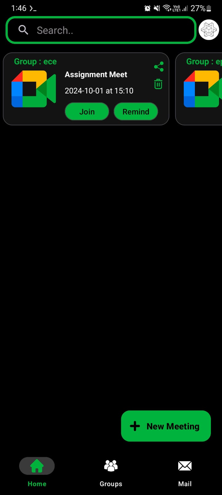
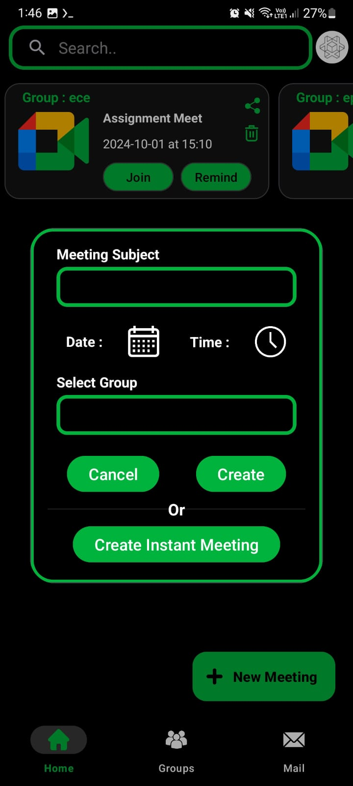
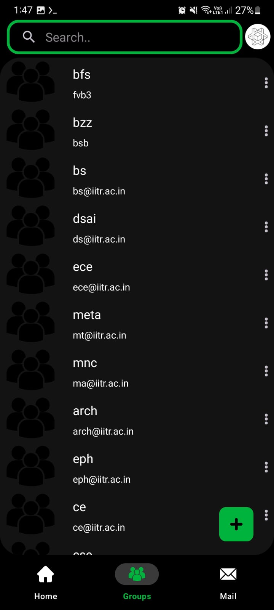
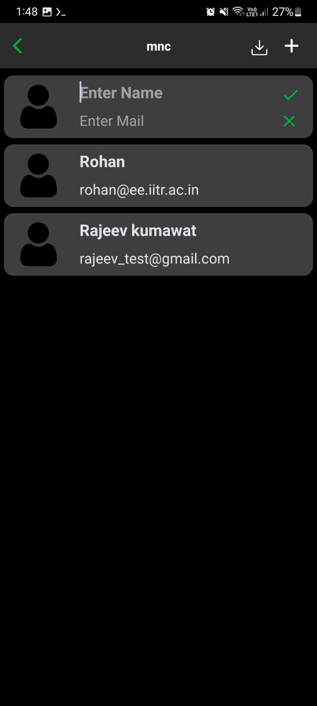
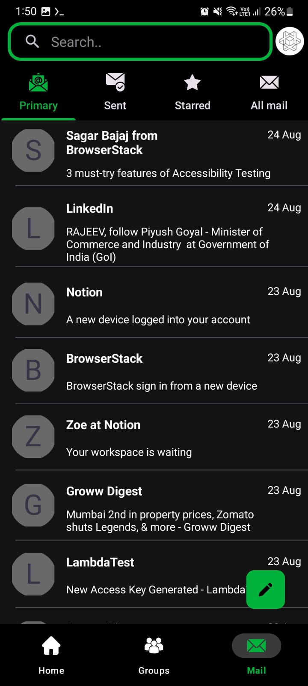
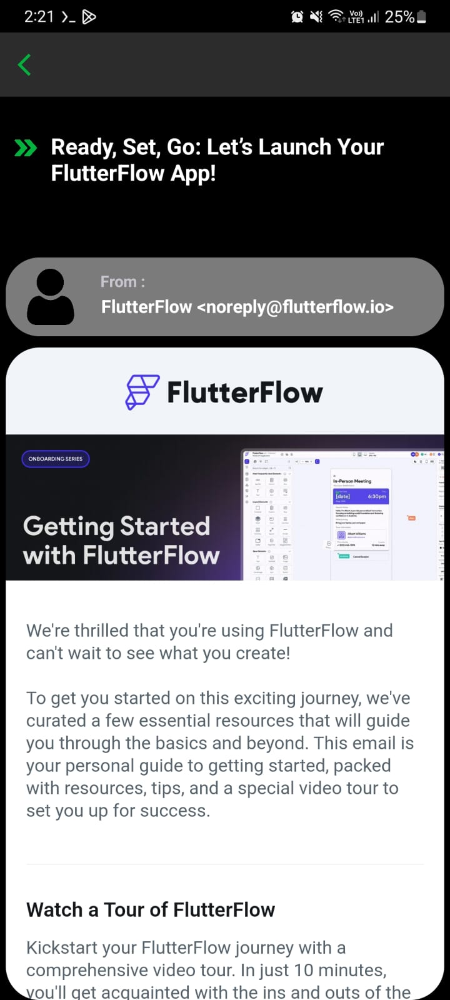
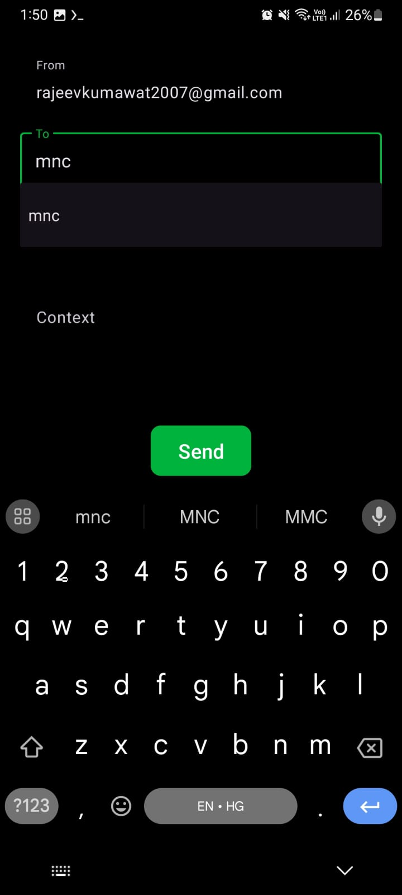
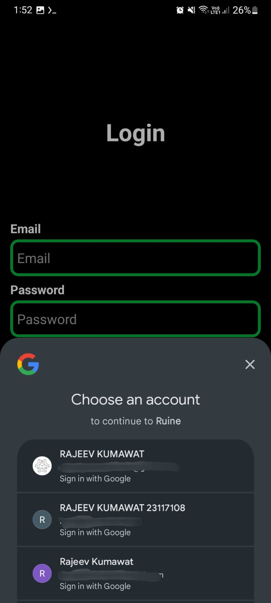
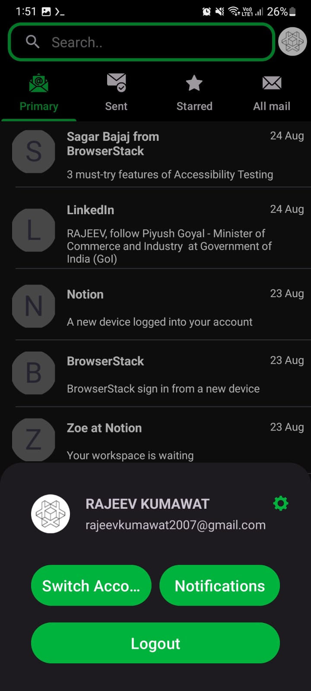

# Ruine (Mail Manager for unorganized teams) 

Mail Group Manager is an Android application that integrates with Gmail, Google Meet, and Google Calendar APIs, allowing users to manage their emails, create groups, and organize group-specific meetings seamlessly.

## Features

 **View Emails**: Access and view your Gmail inbox, read emails, and manage conversations directly within the app.

**Send Emails** : Compose and send emails to individuals or groups with an intuitive interface.

**Create Mail Groups** : Organize contacts into custom groups for better email management and communication.

**Send Emails to Groups** : Quickly send one email to an entire group, saving time and improving workflow.

**Group-Specific Meetings** : Create and schedule meetings using Google Meet and Calendar APIs, specifically tailored for each group. Can add reminders for each meeting.

## Getting Started

Download the apk distribution from lastest release

**Permissions Required** :

  Internet: Access Google APIs.
  
  Account Access: To manage and authenticate Gmail, Calendar, and Meet functionalities.
  Usage
  
  Login: Sign in with your Google account to access Gmail, Calendar, and Meet functionalities.

## Key Features and Samples
   **Meetings :**
   
   Create New meetings with date and time of a particular group , also it reminds all the groups member using google calender Api.
   
                                                                 

  **Groups :**
  
  Create Groups and add members either manually or with excel sheet with a format of name and mail .
  
                                            

  **Mails :**
  
  Read all the mails directly from the app.
  
                                         

  Send Mails to any specific person or group.

   

  Login and Logout Seamlessly by new Android's Authenticator with google 
  
                                          

  
  
Fork the repository.

Create a new branch (git checkout -b myBranch).

Commit your changes (git commit -m 'Add some feature').

Push to the branch (git push origin myBranch).

Open a pull request.

